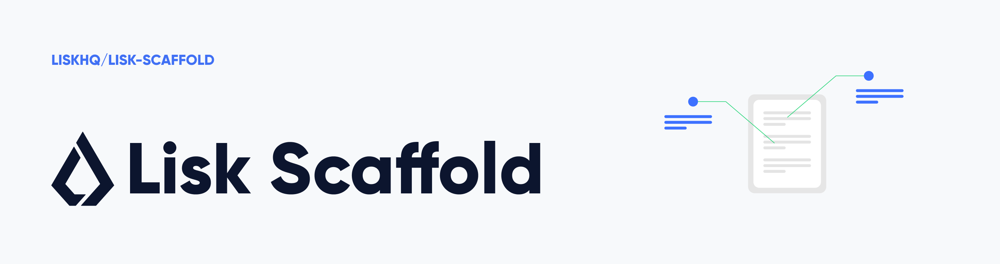
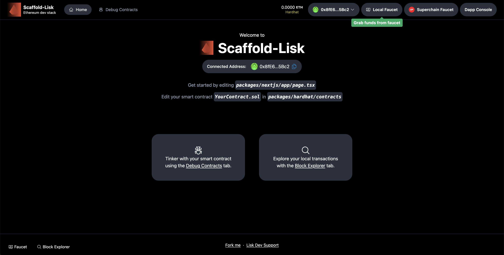

<div align="left">
  <a href="https://lisk.com"></a>
</div>

<br />

# 🎉 Week 4: Oracles & Sponsored Transactions

This repository contains the complete implementation of **Week 4 Challenge** for the Lisk SEA Campaign, featuring:
- 🔮 **Oracle Integration** with RedStone for live price feeds
- ⛽ **Gasless Transactions** using ERC-4337 Account Abstraction

---

## 🚀 Quick Start

**⚠️ IMPORTANT: Follow these steps before running the app!**

### 1. Install Dependencies
```bash
# Install hardhat packages
cd packages/hardhat
yarn add @redstone-finance/evm-connector

# Install frontend packages
cd ../nextjs
yarn add @redstone-finance/evm-connector @redstone-finance/sdk ethers@^5.7.2 thirdweb
```

### 2. Setup thirdweb API Key
1. Get your Client ID from [thirdweb.com/dashboard/settings/api-keys](https://thirdweb.com/dashboard/settings/api-keys)
2. Create `.env.local`:
   ```bash
   cd packages/nextjs
   cp .env.local.example .env.local
   ```
3. Add your Client ID to `.env.local`

### 3. Deploy & Run
```bash
# Deploy contracts
yarn deploy --network liskSepolia

# Start the app
yarn start
```

Visit:
- **Oracle Page**: http://localhost:3000/oracle
- **Gasless Page**: http://localhost:3000/gasless

📚 **See [WEEK4_IMPLEMENTATION_GUIDE.md](./WEEK4_IMPLEMENTATION_GUIDE.md) for complete instructions!**

---

## 📁 What's New in Week 4

### Smart Contracts
- ✅ `PriceFeed.sol` - RedStone oracle integration for ETH/BTC prices

### Frontend Pages
- ✅ `/oracle` - Live cryptocurrency price feeds
- ✅ `/gasless` - Gasless NFT minting with Smart Wallets

### Features
- 🔮 Real-time price data from RedStone oracle
- ⛽ $0 gas fees using ERC-4337 Smart Wallets
- 🎨 Mint NFTs without paying gas
- 🔄 Auto-refreshing price feeds
- 💼 Works with existing MyToken & MyNFT contracts (no changes needed!)

---

<br />

Scaffold-Lisk is a fork of Scaffold-OP with minimal differences, providing additional dApp examples, native support for Superchain testnets, and more low-level instructions. We highly recommend the Scaffold-ETH2 docs as the primary guideline.

🧪 An open-source, up-to-date toolkit for building decentralized applications (dapps) on the Ethereum blockchain. It's designed to make it easier for developers to create and deploy smart contracts and build user interfaces that interact with those contracts.

⚙️ Built using NextJS, RainbowKit, Hardhat, Wagmi, Viem, and Typescript.

- ✅ **Contract Hot Reload**: Your frontend auto-adapts to your smart contract as you edit it.
- 🪝 **[Custom hooks](https://docs.scaffoldeth.io/hooks/)**: Collection of React hooks wrapper around [wagmi](https://wagmi.sh/) to simplify interactions with smart contracts with typescript autocompletion.
- 🧱 [**Components**](https://docs.scaffoldeth.io/components/): Collection of common web3 components to quickly build your frontend.
- 🔥 **Burner Wallet & Local Faucet**: Quickly test your application with a burner wallet and local faucet.
- 🔐 **Integration with Wallet Providers**: Connect to different wallet providers and interact with the Ethereum network.

<div align="center" style="margin-top: 24px;">
  
</div>

## Requirements

Before you begin, you need to install the following tools:

- [Node (>= v18.17)](https://nodejs.org/en/download/)
- Yarn ([v1](https://classic.yarnpkg.com/en/docs/install/) or [v2+](https://yarnpkg.com/getting-started/install))
- [Git](https://git-scm.com/downloads)

## Quickstart

To get started with Scaffold-Lisk, follow the steps below:

1. Clone this repo & install dependencies

```
git clone https://github.com/LiskHQ/scaffold-lisk.git
cd scaffold-lisk
yarn install
```

2. Run a local network in the first terminal:

```
yarn chain
```

This command starts a local Ethereum network using Hardhat. The network runs on your local machine and can be used for testing and development. You can customize the network configuration in `hardhat.config.ts`.

3. On a second terminal, deploy the test contract:

```
yarn deploy
```

This command deploys a test smart contract to the local network. The contract is located in `packages/hardhat/contracts` and can be modified to suit your needs. The `yarn deploy` command uses the deploy script located in `packages/hardhat/deploy` to deploy the contract to the network. You can also customize the deploy script.

4. On the same terminal, start your NextJS app:

```
yarn start
```

Visit your app on: `http://localhost:3000`. You can interact with your smart contract using the `Debug Contracts` page. You can tweak the app config in `packages/nextjs/scaffold.config.ts`.

Run smart contract test with `yarn hardhat:test`

- Edit your smart contract `YourContract.sol` in `packages/hardhat/contracts`
- Edit your frontend in `packages/nextjs/pages`
- Edit your deployment scripts in `packages/hardhat/deploy`

## Deploy Contracts to Superchain Testnet(s)

To deploy contracts to a remote testnet (e.g. Optimism Sepolia), follow the steps below:

1. Get Superchain Sepolia ETH from the [Superchain Faucet](https://app.optimism.io/faucet)

2. Inside the `packages/hardhat` directory, copy `.env.example` to `.env`.

   ```bash
   cd packages/hardhat && cp .env.example .env
   ```

3. Edit your `.env` to specify the environment variables. Only specifying the `DEPLOYER_PRIVATE_KEY` is necessary here. The contract will be deployed from the address associated with this private key, so make sure it has enough Sepolia ETH.

   ```bash
   DEPLOYER_PRIVATE_KEY = "your_private_key_with_sepolia_ETH";
   ```

4. Inside `scaffold-lisk`, run

   ```bash
   yarn deploy --network-options
   ```

   Use spacebar to make your selection(s). This command deploys all smart contracts in `packages/hardhat/contracts` to the selected network(s). Alternatively, you can try

   ```bash
   yarn deploy --network networkName
   ```

   Network names are found in `hardhat.config.js`. Please ensure you have enough Sepolia ETH on all these Superchains. If the deployments are successful, you will see the deployment tx hash on the terminal.

## Adding Foundry

Hardhat's NodeJS stack and cleaner deployment management makes it a better default for Scaffold-Lisk.

To add Foundry to Scaffold-Lisk, follow this simple [tutorial](https://hardhat.org/hardhat-runner/docs/advanced/hardhat-and-foundry) by Hardhat. We recommend users who want more robust and faster testing to add Foundry.

## Documentation

We highly recommend visiting the original [docs](https://docs.scaffoldeth.io) to learn how to start building with Scaffold-ETH 2.

To know more about its features, check out their [website](https://scaffoldeth.io).

## What I did (deployment & verification)

Notes and commands run during my submission process (UTC: 2025-10-25):

- Deployed contracts to Lisk Sepolia using the Hardhat deploy script:

   ```bash
   yarn deploy --network liskSepolia
   ```

- Deployment results (from the terminal):
   - `MyToken` deployed at: `0x31BF0d589E1c2f459F9E635d60430903EAF68053`
   - `MyNFT` deployed at: `0xBB6FB11933aE98d6136E2496fe41f163E498E50F`

- One contract deployment failed during that run:
   - `BuyMeACoffee` failed with a nonce error: `NONCE_EXPIRED` / "nonce too low".
   - This indicates a pending or already-used nonce for the deployer address. Resolution options:
      - Wait for any pending tx to confirm, or
      - Replace the stuck transaction by resending with the same nonce and a higher gas price, or
      - Use the provider's pending nonce when sending transactions (the deploy scripts were updated locally to call `provider.getTransactionCount(deployer, "pending")` when needed).

- Verified `MyNFT` on the configured Blockscout/Etherscan-like endpoint with Hardhat verify:

   ```bash
   yarn hardhat-verify --network liskSepolia --contract contracts/MyNFT.sol:MyNFT 0xBB6FB11933aE98d6136E2496fe41f163E498E50F
   ```

- Environment & notes:
   - The deployer key is read from `packages/hardhat/.env` as `DEPLOYER_PRIVATE_KEY`.
   - Hardhat printed a Node.js compatibility warning (Node.js v24.8.0). Hardhat is officially tested on older Node versions; consider using a supported Node.js LTS (e.g., v18 or v20) to avoid unexpected behavior.
   - Blockscout URL for the `MyNFT` address (view transactions / contract):
      https://sepolia-blockscout.lisk.com/address/0xBB6FB11933aE98d6136E2496fe41f163E498E50F

If you'd like, I can add this summary as a separate `SUBMISSION.md` file, include screenshots or a short demo GIF in `packages/nextjs/public/`, and/or run the test suite and validate everything automatically — tell me which next step you want me to take.
# sp_lsk_4
